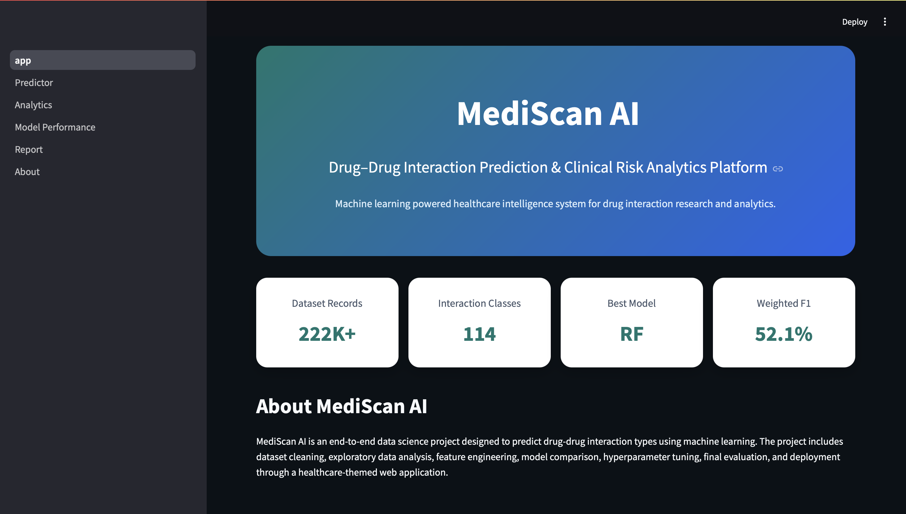
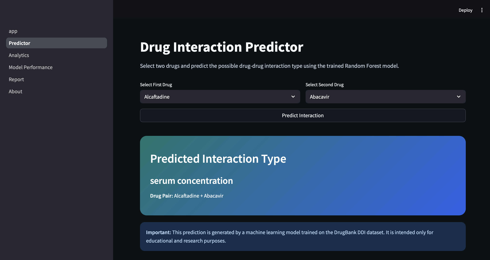
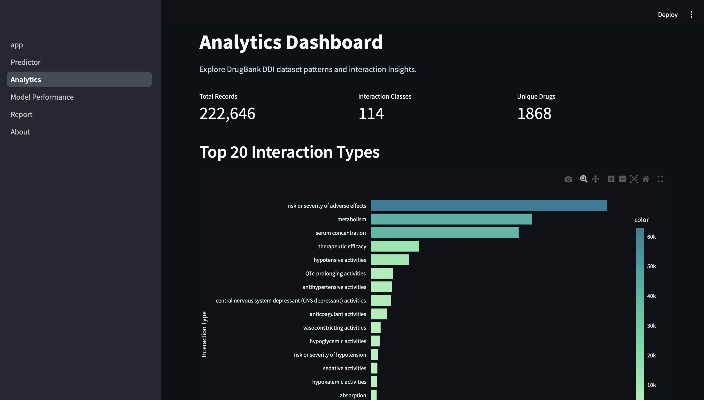
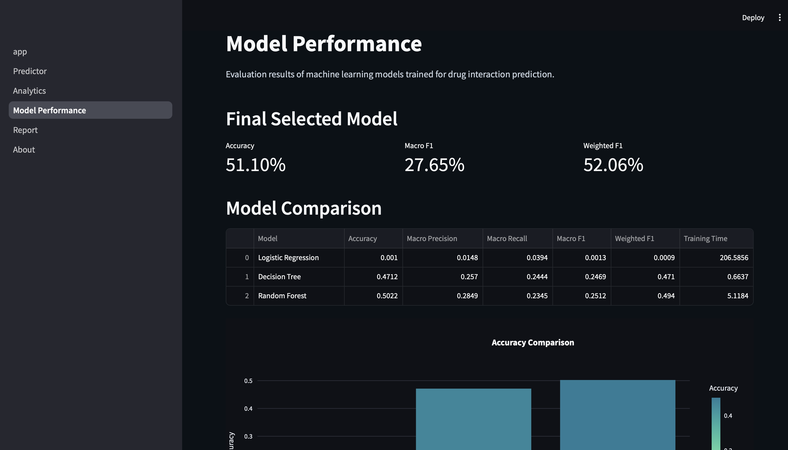
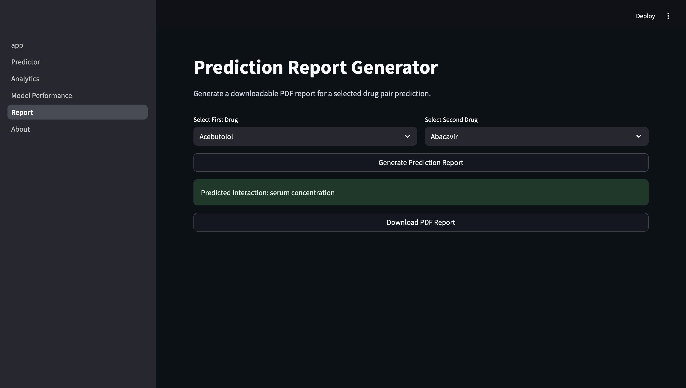

#  MediScan AI

## Drug–Drug Interaction Prediction using Machine Learning

MediScan AI is an end-to-end Machine Learning project that predicts potential Drug–Drug Interaction (DDI) types using the DrugBank DDI dataset.

The project includes data preprocessing, exploratory data analysis, feature engineering, model comparison, hyperparameter tuning, PDF report generation, and an interactive Streamlit web application.

---

# Project Motivation

Drug–Drug Interactions can lead to severe adverse effects when multiple medications are prescribed together.

Healthcare professionals must identify potential interactions quickly, but manually checking thousands of combinations is difficult.

MediScan AI demonstrates how Machine Learning can assist in predicting interaction types for educational and research purposes.

---

# Features

- Drug–Drug Interaction Prediction
- Data Cleaning Pipeline
- Exploratory Data Analysis
- Feature Engineering
- Multiple ML Model Comparison
- Hyperparameter Tuning (GridSearchCV)
- Model Performance Dashboard
- PDF Report Generation
- Interactive Streamlit Web Application


---

# Application Screenshots

## Home Page


## Drug Interaction Predictor


## Analytics Dashboard


## Model Performance


## PDF Report Generator


---

# Dataset

**Source**

DrugBank Drug–Drug Interaction Dataset

Dataset contains approximately:

- 222,000+ interaction records
- 114 interaction classes
- Thousands of unique drugs

---

# Machine Learning Pipeline

Data Collection

↓

Data Cleaning

↓

Exploratory Data Analysis

↓

Feature Engineering

↓

Model Training

↓

Model Comparison

↓

Hyperparameter Tuning

↓

Model Deployment

---

# Models Evaluated

- Logistic Regression
- Decision Tree
- Random Forest
- XGBoost

Final selected model:

**Random Forest**

---

# Technologies Used

- Python
- Pandas
- NumPy
- Scikit-learn
- XGBoost
- Plotly
- Streamlit
- ReportLab
- Joblib

---

# Folder Structure

```
MediScan-AI
│
├── app/
├── data/
├── models/
├── notebooks/
├── reports/
├── requirements.txt
└── README.md
```

---

# Installation

```bash
git clone https://github.com/thishan2004/MediScan-AI.git

cd MediScan-AI

pip install -r requirements.txt

streamlit run app/Home.py
```

---

# Disclaimer

This project is developed for educational and research purposes only.

It should **not** be used for clinical decision-making.

---

# Author

**Thishanujan Kugathasan**

BSc (Hons) Information Technology (Data Science)

Sri Lanka Institute of Information Technology (SLIIT)

GitHub

https://github.com/thishan2004
